# Effects of workload aggregation on system load

## Overview

* Multi-tenancy significantly reduces the peak-to-average ratio of overall system load
  * In general, systems must provision for peak demand, not average load
  * Lower peak-to-average ratios directly translate to fewer overprovisioned resources
  * This results in improved resource utilization and cost efficiency

This simulation is inspired by Andrew Warfield's talk at FAST '23: ["Building and Operating a Pretty Big Storage System (My Adventures in Amazon S3)"](https://www.youtube.com/watch?v=sc3J4McebHE&t=1333s).
It a key principle behind large-scale distributed systems like Amazon S3.

Please note that this script contains a lot of assumptions about the simulated workloads and doesn't necessarily match reality. The goal has been to visualize the effects of workload aggregation on system load.

## Features

- **Interactive Visualization:** Dynamically adjust the number of aggregated workloads (k × k grid)
  - **Keyboard Controls:**
    - Use arrow keys (↑/↓/←/→) to adjust the number of workloads
    - Toggle between visualization modes with `Tab` key
    - Save screenshots with `s` key
    - Regenerate workloads by pressing `Space` or `Enter` key
    - Press `q` or `Esc` key to exit
- **Two Visualization Modes:**
  - **Workload Mode:** Shows individual workloads and their aggregation
  - **Overprovisioning Mode:** Visualizes how the required overprovisioning factor decreases as more workloads are aggregated
- **Batch mode:**
  - Generate image files and exit

## Installation

1. Install uv: https://docs.astral.sh/uv/getting-started/installation/

2. Run the script directly (dependencies will be automatically installed when using uv):

   ```shell
   ./workload-aggregation-visualizer.py
   ```

## Usage

Run the script to start in UI mode, the console will contain information about keybindings:

```shell
./workload-aggregation-visualizer.py
```

pass `--help` to see complete set of command line options

## Visualization example

Images were generated with this command:

```shell
./workload-aggregation-visualizer.py --output-dir examples --format svg --plot-overprovisioning --batch
```

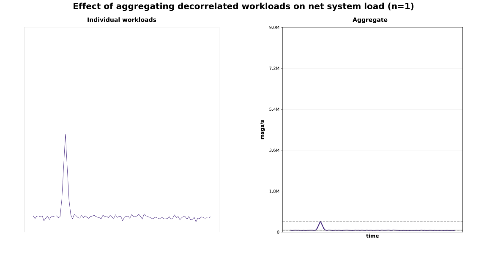
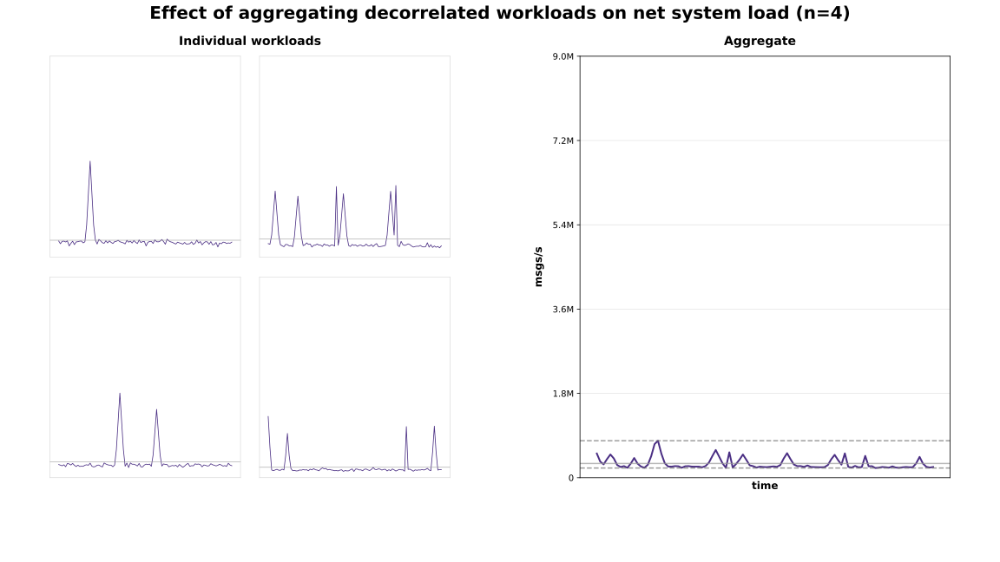
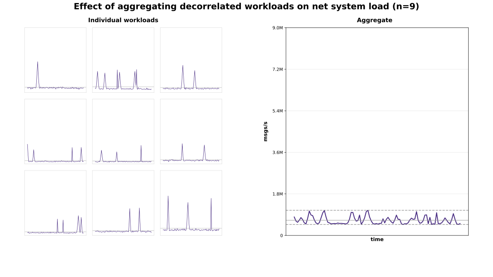
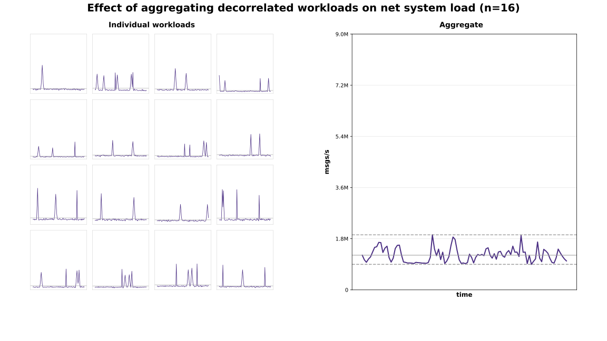
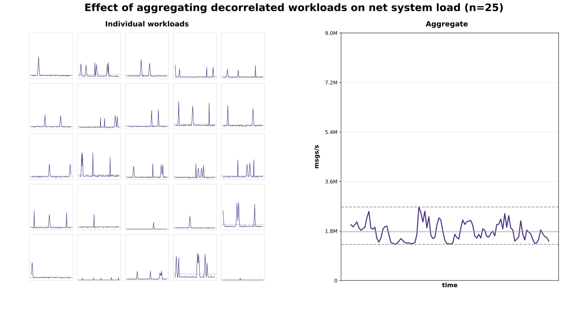
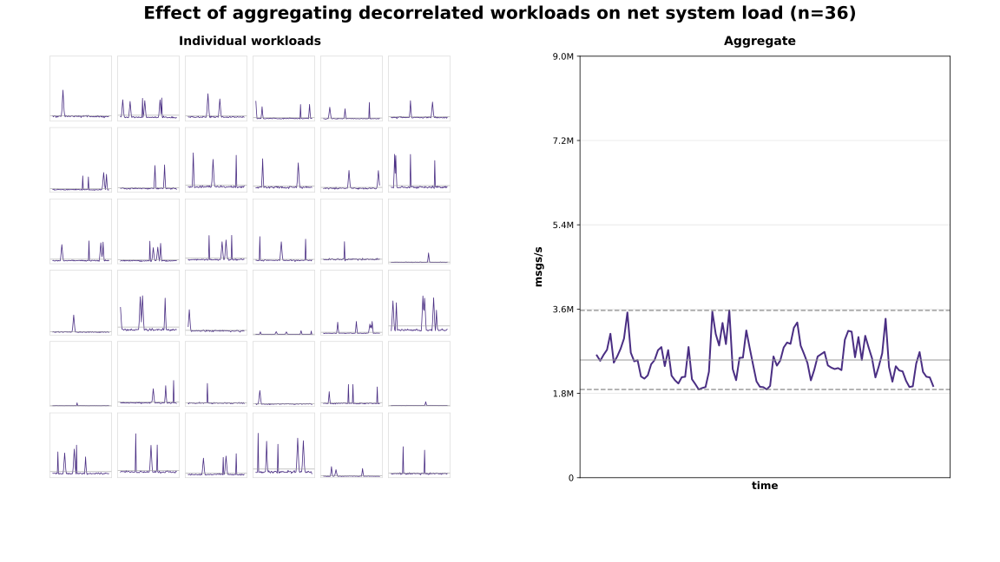
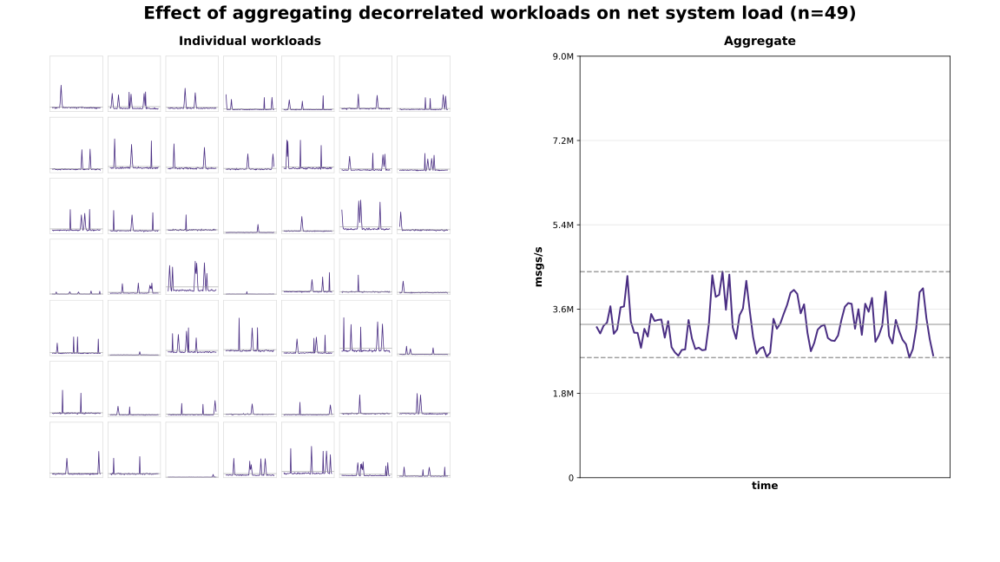
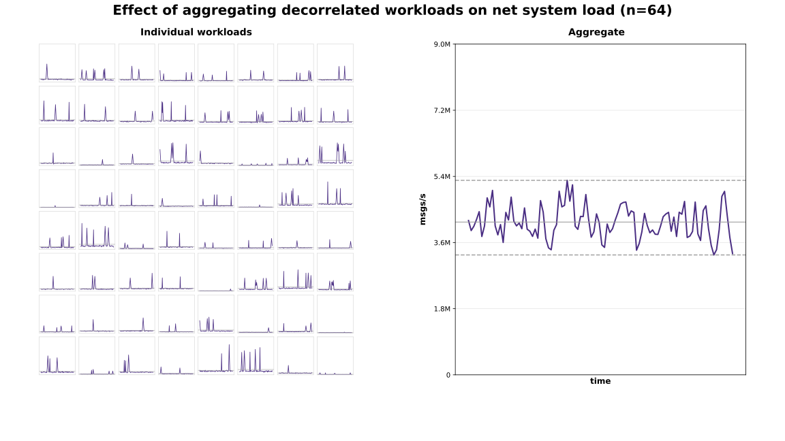
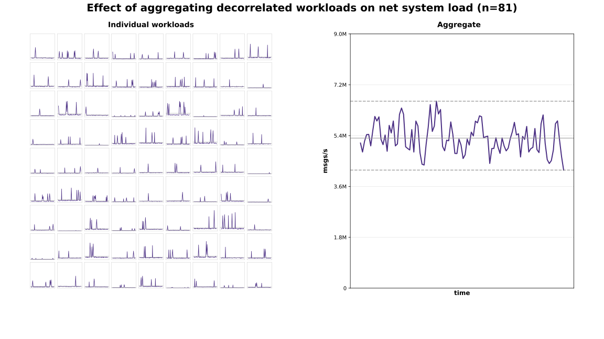
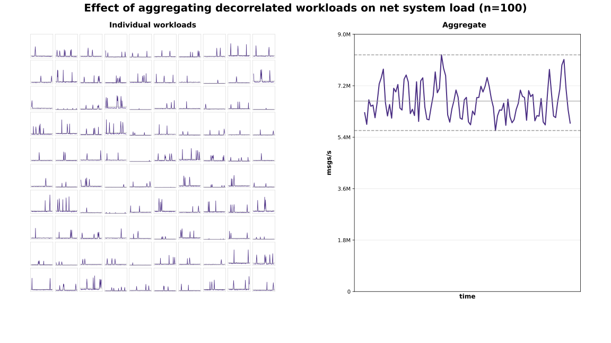
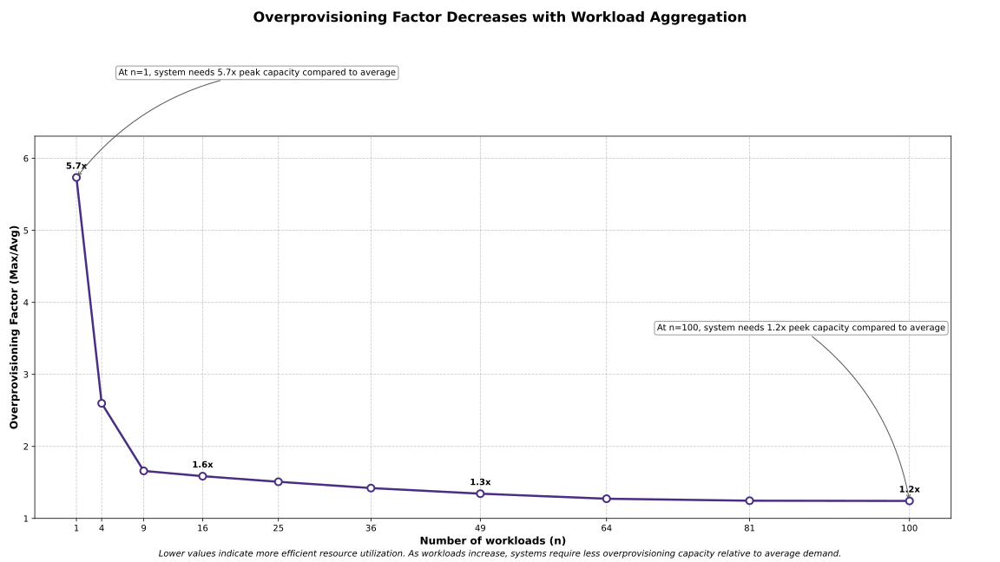

## Resources related to economics of scale in cloud services

These aren't necessary directly related to the visualization in this project. These resources were the inspiration to create this visualization.

- [Andy Warfield: Building and Operating a Pretty Big Storage System (My Adventures in Amazon S3), part "Individual workloads are bursty", presentation at FAST'23](https://www.youtube.com/watch?v=sc3J4McebHE&t=1333s)
- [Marc Brooker: Surprising Scalability of Multitenancy, blog post 2023-03-23](https://brooker.co.za/blog/2023/03/23/economics.html)
- [Marc Brooker: Surprising Economics of Load-Balanced Systems, blog post 2020-08-06](https://brooker.co.za/blog/2020/08/06/erlang.html)
- [Jack Vanlightly: On the future of cloud services and BYOC, blog post 2023-09-25](https://jack-vanlightly.com/blog/2023/9/25/on-the-future-of-cloud-services-and-byoc)

## License

This project is licensed under the MIT License with attribution requirements - see the [LICENSE](LICENSE) file for details.

## Author

Created by Lari Hotari